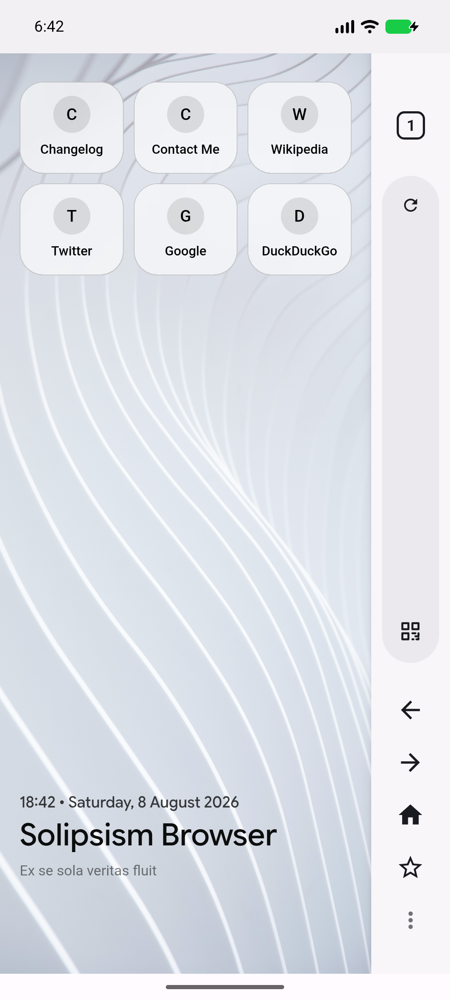
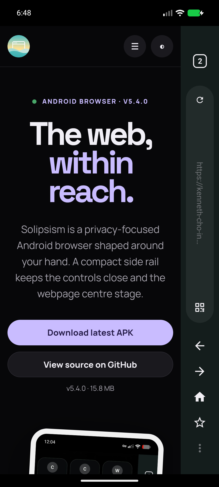
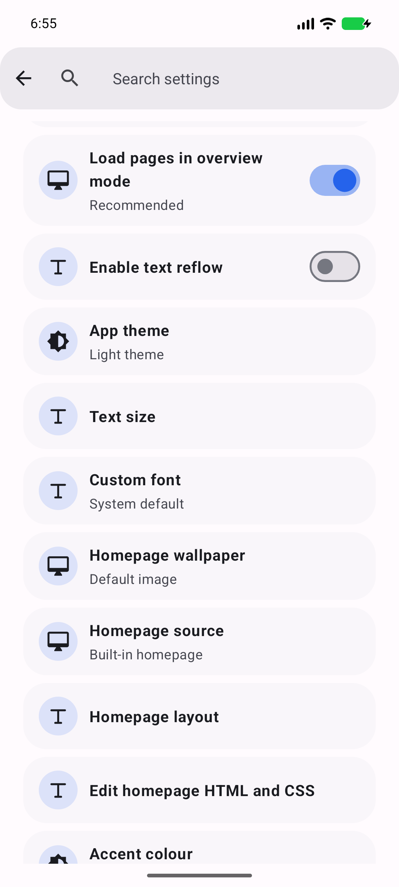
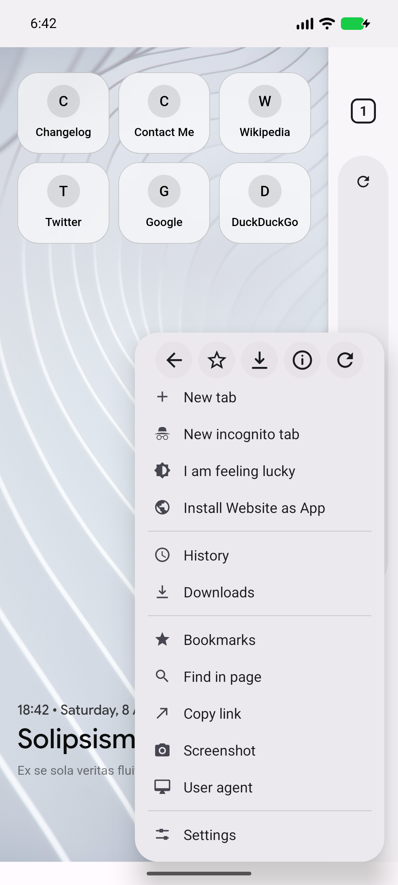
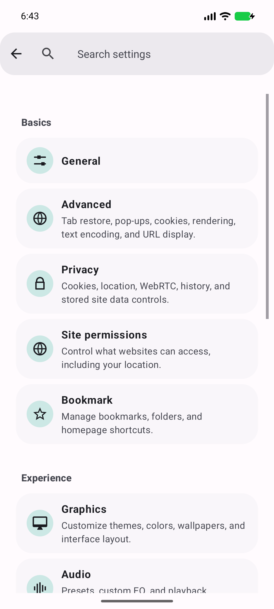
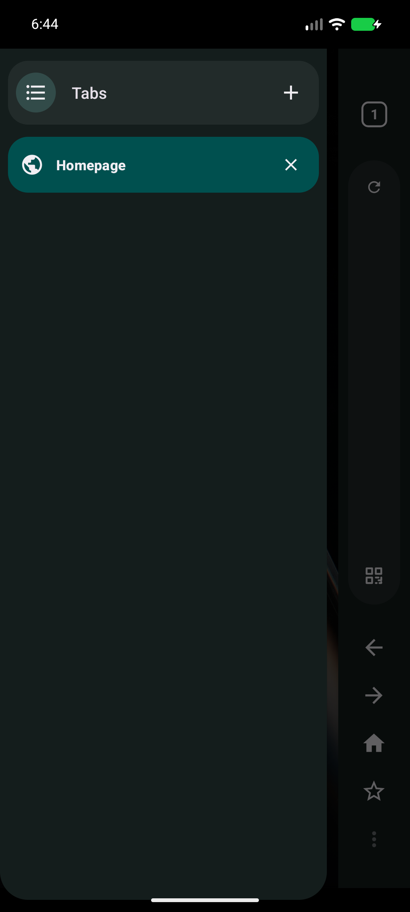
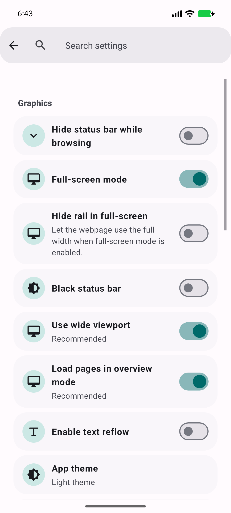
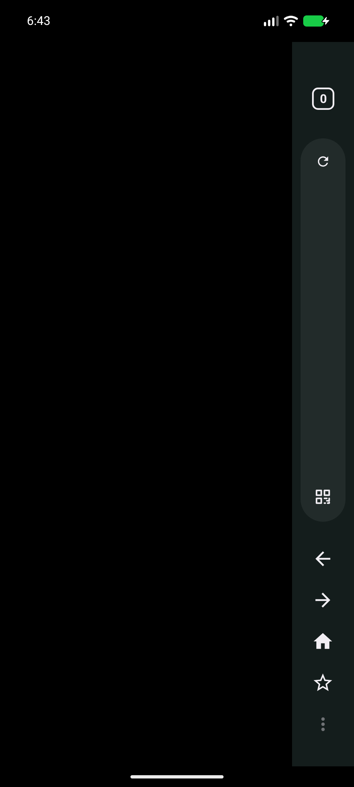

# Solipsism Browser

<p align="center">
  
</p>

<table align="center">
  <tr>
    <td align="center"></td>
    <td align="center"></td>
    <td align="center"></td>
  </tr>
</table>

Solipsism Browser is a privacy-focused Android WebView browser built around a rail-first, one-handed interface. Navigation, tabs, search, QR scanning, refresh, bookmarks, and browser tools live in a compact rail on the left or right, leaving the webpage as the main surface.

Latest release: [**Solipsism Browser v8.0.0**](https://github.com/Kenneth-Cho-InfoSec/Solipsism/releases/latest)<br>
Application ID: `com.krystelligence.solipsism`<br>
Developer: **Kenneth-Cho-InfoSec**

## Optional Antares browser core

Solipsism 8.0.0 provides a unified browser experience with Android WebView as its stable core and
**Antares 0.2.0** as an experimental in-house Servo-derived core. The Solipsism source tree contains
the host integration, protocol, and native JNI support, while Antares is also published as a separate
signed ARM64 companion package so the engine can be updated and tested independently. Android WebView
remains the stable fallback.

To enable Antares:

1. Install the signed Solipsism APK from the [Solipsism releases](https://github.com/Kenneth-Cho-InfoSec/Solipsism/releases).
2. Download and install the matching ARM64 **Antares Engine** APK from the [Antares releases](https://github.com/Kenneth-Cho-InfoSec/Antares/releases). Both packages are required when selecting the companion core; Antares cannot be enabled by installing Solipsism alone.
3. Open Solipsism and choose Antares in the browser-core chooser or Debug Settings. Solipsism verifies the companion package and its signing certificate before binding.
4. If Antares is unavailable or a site is incompatible, select Android WebView to return to the stable core.

Antares is experimental. Complex sites, including YouTube and Amazon, may have incomplete
interaction, CAPTCHA or media playback behaviour. Core switching is global and applies to all
tabs. Do not install Antares APKs from unofficial sources.

[](https://github.com/Kenneth-Cho-InfoSec/Solipsism/releases/latest)
[](https://gitlab.com/Kenneth-Cho-InfoSec/fdroiddata/-/merge_requests/5)

Solipsism is loosely based on the open-source [Lightning Browser](https://github.com/anthonycr/Lightning-Browser). It is a continuation fork: the original project provided an early foundation, while Solipsism has been extensively modernised, secured, redesigned, and customised for current Android WebView, privacy, accessibility, one-handed browsing, and optional Antares rendering.

## Why Solipsism?

- **Rail-first interaction** keeps frequent browser actions reachable with one hand.
- **Privacy controls are visible and configurable**, instead of being hidden behind a single “private mode” switch.
- **Power-user features are built in**: userscripts, cosmetic ad blocking, custom filters, site permissions, malware scanning, and homepage customization.
- **The interface is adaptable** with themes, accent colors, AMOLED mode, wallpapers, compact layouts, custom fonts, and accessibility controls.
- **The app is designed for Android WebView**, so unsupported platform capabilities are identified as experimental rather than presented as fully reliable browser permissions.

## Spotlight Features

### Tampermonkey-compatible userscripts

Solipsism includes an experimental userscript manager for scripts using the familiar Tampermonkey/Greasemonkey metadata format:

- Import scripts from a local `.js` file.
- Import scripts from an HTTPS URL.
- Enable or disable the userscript runtime globally.
- Review and manage installed scripts.
- Respect common metadata such as `@match`, `@include`, `@exclude`, `@run-at`, `@name`, and `@description`.
- Inject scripts at supported document lifecycle points.

This is a WebView-compatible userscript runtime, not the full Tampermonkey extension API. Unsupported privileged APIs are not silently emulated. Scripts should be treated as executable code: only install scripts from sources you trust.

### Screenshot capture

The three-dot menu includes a screenshot action that captures the current webpage surface without the Solipsism rail. The capture provides visual feedback with a 70% shrink animation, rounded corners, a brief translucent white flash, and device vibration.



### Rail & Menu Studio

Rail & Menu Studio lets users customise the browser rail and overflow menu:

- Move supported actions between the rail and overflow menu.
- Reorder rail icons with drag and drop.
- Configure up to eight movable rail actions.
- Keep Tabs and the overflow menu action permanently available.
- Configure five optional quick actions in the overflow menu.
- Prevent duplicate actions across the rail and menu.
- Resize the URL bar automatically as rail actions change.
- Restore the default layout at any time.

### Release notes and update reminders

Solipsism can check the official GitHub release feed for release notes belonging to the installed version and notifications about newer stable releases. Where available, update prompts link directly to the corresponding GitHub APK asset. Both behaviours can be disabled independently in About settings.

### Site permissions

The Site Permissions section provides per-site controls for browser capabilities, with separate global and site-specific decisions where Android WebView permits them:

Standard controls include:

- Location/GPS
- Camera
- Microphone
- Notifications
- Clipboard access
- Motion sensors
- Protected content
- Embedded content
- Local network access
- Automatic downloads

Additional controls are labelled **Experimental** because Android WebView does not reliably expose or enforce every browser permission independently:

- NFC
- USB
- Serial devices
- File editing
- Virtual reality
- Augmented reality
- Device use
- Apps on the device
- JavaScript JIT

Experimental controls are best-effort policy signals and should not be treated as equivalent to a desktop browser’s fully enforced permission sandbox.



### Adblocker

The Adblocker section combines network and cosmetic controls:

- Host-based ad and tracker blocking.
- uBlock-style cosmetic filtering where supported.
- Custom filter rules.
- An element picker for creating a rule from a page element.
- Filter-language help beside the custom filter editor.
- Optional blocking of animated GIF images.
- Selectable host-list sources and manual refresh.

The custom filter language supports common cosmetic-filter patterns such as `##` for hiding matching elements and `#@#` for exceptions. WebView limitations mean this is a focused, browser-safe subset rather than a complete uBlock Origin engine.

### Malware Scanner

Malware Scanner is a layered download-safety feature:

- Local definitions-based scanning works without an API key.
- Malware definitions can be refreshed and configured in settings.
- Image and video scanning can be enabled separately.
- Optional VirusTotal scanning can be configured with the user’s own API key.
- Downloads can be scanned, downloaded while skipping scanning, or cancelled.
- Suspicious files are blocked with a detection prompt.
- Scanning state is shown in the download dialog and notification.
- A disclaimer explains that no malware scanner is 100% accurate and that the feature is an aid, not a replacement for a complete cybersecurity program.

Malware Scanner is a defence-in-depth feature. Users should still use trusted sources, keep Android updated, maintain endpoint protections, and follow applicable cybersecurity compliance procedures.

## Browsing Features

- WebView browsing with tabs and tab overview.
- Vertical URL/search rail with an expanded URL editor.
- Left or right side rail positioning.
- Small, Medium, Large, and Super Compact rail sizes.
- Experimental top and bottom rail layouts behind Debug settings.
- QR code scanning with an optional downloadable module design.
- Configurable rail and overflow-menu actions through Rail & Menu Studio.
- Long-press refresh with JavaScript-disabled reload.
- Find in page, copy link, share, add bookmark, history, and downloads.
- Install Website as App through Android shortcuts.
- File upload support through Android’s system picker.
- Fullscreen video support with rail and system-bar handling.
- Current-page screenshot capture without the browser rail.
- Screenshot Studio with save and image-search workflows.
- Optional automatic conversion of downloaded images to JPEG.
- Text-to-speech accessibility support.
- Folding-phone user-agent option.



## Homepage Customization

The homepage supports:

- Built-in Solipsism homepage.
- Wallpaper selection, including light, dark, non-AMOLED, and AMOLED-black presentation.
- Custom wallpaper positioning and opacity.
- Bookmark shortcut visibility and column count.
- Custom motto text, size, and opacity.
- Configurable date and time display, formats, and opacity.
- Sanitized static HTML and CSS imported from the device.
- Direct HTML/CSS editing in the app.
- An HTTPS website homepage in restricted safe mode.

Custom HTML is sanitized and stored in app-private storage. JavaScript, downloads, forms, frames, remote resources, executable content, and file access are disabled for static custom homepages. Homepage file navigation is restricted to Solipsism-generated private pages; arbitrary public-storage files are not accepted as browser pages.

## Privacy and Security Controls

- Incognito browsing.
- Cookie Manager with per-site cookie viewing, editing, removal, and deletion.
- Third-party cookie control.
- Do Not Track and identifying-header controls.
- WebRTC configuration.
- Clear cache, history, cookies, and web storage individually or on exit.
- Site-specific permission policies.
- JavaScript and popup controls.
- File and content access restrictions in WebView.
- Safe Browsing enabled when supported by the installed WebView provider.
- Hardened handling for `intent://`, `file://`, `content://`, `data:`, and `javascript:` navigation.
- Canonical-path checks for app-generated internal HTML pages.

### Decoy Mode

From the history page, long-pressing Clear All History opens Decoy Mode. It can replace recent history with randomized, coherent-looking browsing sessions rather than a flat list of unrelated URLs.

## Appearance, Accessibility, and Audio

- Light, dark, and true AMOLED-black themes.
- Multiple accent palettes and Android system accent matching.
- Dynamic color updates when supported by Android.
- Consistent Material Design 3 settings and dialogs.
- Custom local font import with size validation.
- Text size, text reflow, wide viewport, overview mode, and rendering controls.
- Audio settings under Graphics.
- Global Solipsism audio-effects toggle.
- Custom equalizer controls and presets such as bass boost and vocal boost.
- Left/right channel test playback.
- Accent-aware rail, buttons, dialogs, and selected controls.

<table>
  <tr>
    <td></td>
    <td></td>
  </tr>
</table>

## Download and Data Safety

Downloads support common file types through Android’s DownloadManager and browser handling. Blob downloads have size limits, user-provided userscripts are size-checked, and dangerous navigation paths are rejected. Malware scanning is applied according to the configured policy, with an explicit skip-scanning option for users who understand the trade-off.

## Permissions

Declared permissions are limited to the browser’s core operation:

- `INTERNET` for web access.
- `ACCESS_NETWORK_STATE` for connectivity state.
- `POST_NOTIFICATIONS` for download and scan notifications.

Requested only when needed:

- `CAMERA` for QR scanning and optional WebRTC video capture.
- `RECORD_AUDIO` and `MODIFY_AUDIO_SETTINGS` for optional WebRTC audio capture.
- `ACCESS_FINE_LOCATION` and `ACCESS_COARSE_LOCATION` for website location requests when enabled.

Android and WebView may still enforce additional system-level prompts or limitations. Denying a permission keeps the corresponding capability unavailable.

## Build

Requirements:

- Android SDK command-line tools or Android Studio.
- JDK 17 or newer.
- An Android SDK with the project’s compile SDK installed.

Linux/macOS:

```bash
./gradlew :app:assembleSolipsismBrowserDebug
./gradlew :app:assembleSolipsismBrowserRelease
```

Windows PowerShell:

```powershell
.\gradlew.bat :app:assembleSolipsismBrowserDebug
.\gradlew.bat :app:assembleSolipsismBrowserRelease
```

Unit tests and resource validation:

```bash
./gradlew :app:testSolipsismBrowserDebugUnitTest
python3 scripts/check_localized_resources.py
```

Generated APKs are written under:

```text
app/build/outputs/apk/
```

## Product website

The official Astro product website lives in [`website/`](website/). It retrieves release notes and APK assets directly from GitHub Releases at runtime, includes a complete paginated archive, and deploys automatically through GitHub Pages. See the [website README](website/README.md) for development, testing, caching, and deployment instructions.

The GitHub release page contains the current signed release APK. Release signing credentials are intentionally kept outside the repository.

## Translations

The app includes translations for Arabic, Brazilian Portuguese, Chinese Simplified, Chinese Traditional, Dutch, French, German, Greek, Hebrew, Hungarian, Italian, Japanese, Korean, Lithuanian, Polish, Portuguese, Russian, Serbian, Spanish, and Turkish. Users can select a supported language or import a custom language XML file that follows the Android `strings.xml` resource format.

## Support

If Solipsism is useful to you, development can be supported on [Ko-fi](https://ko-fi.com/kennethchoinfosec).

## License

Solipsism Browser is licensed under the Mozilla Public License 2.0. See [LICENSE](LICENSE).
